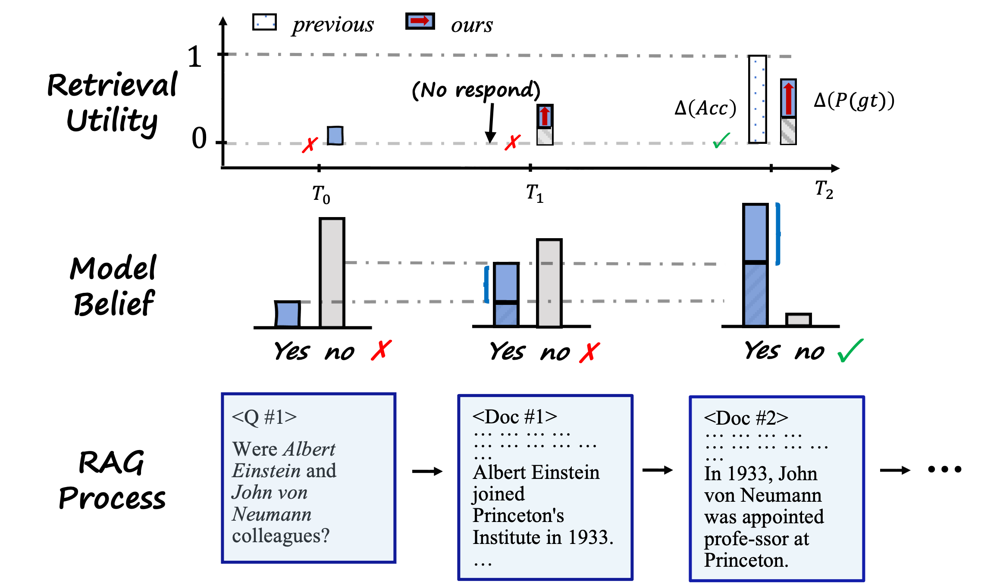

# SePer: Official Implementation

This repository contains the official implementation of our ICLR 2025 **Spotlight** paper:

**SePer: Measure Retrieval Utility Through The Lens Of Semantic Perplexity Reduction**

Authors: Lu Dai, Yijie Xu, Jinhui Ye, Hao Liu, Hui Xiong

Link: [OpenReview](https://openreview.net/forum?id=ixMBnOhFGd)

**Note**: This page is still under construction. We will release the code and data soon.

## Overview

SePer introduces a novel framework to evaluate retrieval utility by analyzing **semantic perplexity** and **semantic perplexity reduction**. This approach provides a more fine-grained measurement of retrieval utility, offering insights beyond traditional evaluation metrics.

Below is a illustration of SePer's ability to perform fine-grained evaluation:



## Installation
Below is the steps for environment preparation:

```bash
conda create -n seper python=3.10
conda activate seper
pip install torch
pip install -r requirements.txt
```

## Quick Start
We provide a jupyter notebook `example.ipynb` to demonstrate the minimal use of seper. You can quickly go through this notebook.


## Benchmark For Retrievers

The benchmark for retrievers is available at [here](https://sepermetric.github.io/).

## Citation

If you find our work useful, please cite our paper:

```bibtex
@inproceedings{dai2025seper,
  title={SePer: Measure Retrieval Utility Through The Lens Of Semantic Perplexity Reduction},
  author={Dai, Lu and Xu, Yijie and Ye, Jinhui and Liu, Hao and Xiong, Hui},
  booktitle={International Conference on Learning Representations (ICLR)},
  year={2025}
}